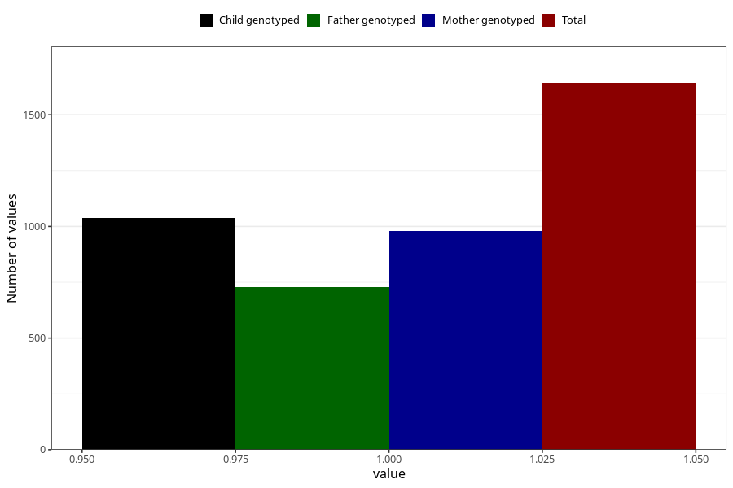

# other_milk_0m
Variable mapping to questionnaire: q4, question DD84.
- Number of values:

| Value | Total | Child genotyped | Mother genotyped | Father genotyped |
| ----- | ----- | --------------- | ---------------- | ---------------- |
| Missing | 111981 | 74393 | 70789 | 49488 |
| Non-missing | 1642 | 1038 | 980 | 730 |
| 1 | 1642 | 1038 | 980 | 730 |

