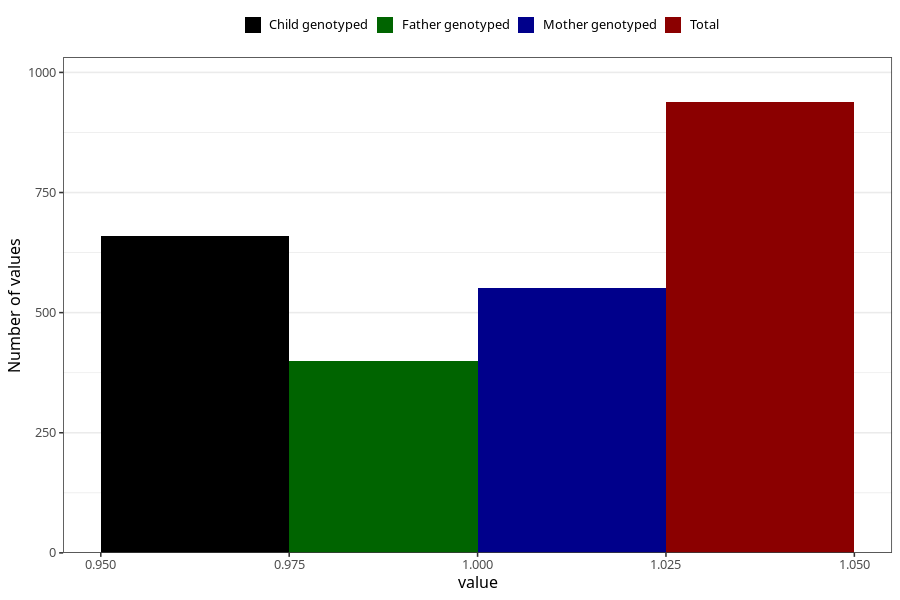

# other_milk_1m
Variable mapping to questionnaire: q4, question DD85.
- Number of values:

| Value | Total | Child genotyped | Mother genotyped | Father genotyped |
| ----- | ----- | --------------- | ---------------- | ---------------- |
| Missing | 112685 | 74845 | 71217 | 49819 |
| Non-missing | 938 | 586 | 552 | 399 |
| 1 | 938 | 586 | 552 | 399 |

