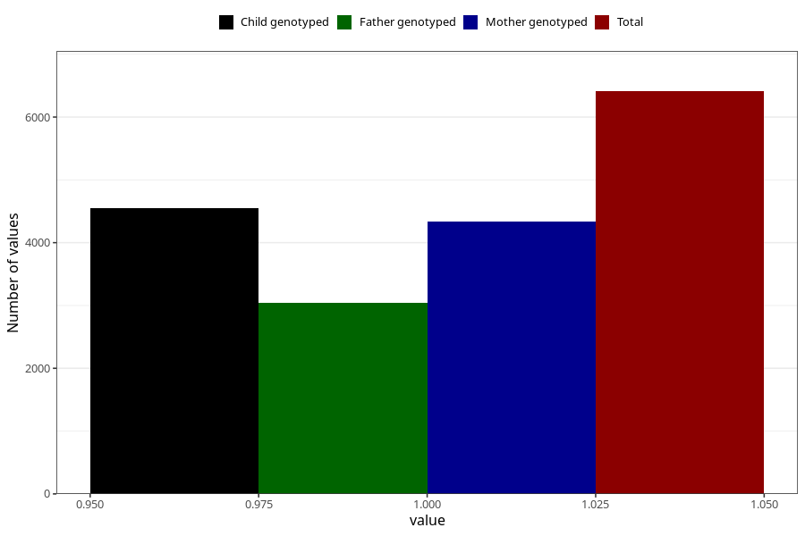

# sugarwater_first_week
Variable mapping to questionnaire: q4, question DD44.
- Number of values:

| Value | Total | Child genotyped | Mother genotyped | Father genotyped |
| ----- | ----- | --------------- | ---------------- | ---------------- |
| Missing | 107213 | 78316 | 67426 | 47170 |
| Non-missing | 6410 | 5039 | 4343 | 3048 |
| 1 | 6410 | 5039 | 4343 | 3048 |

