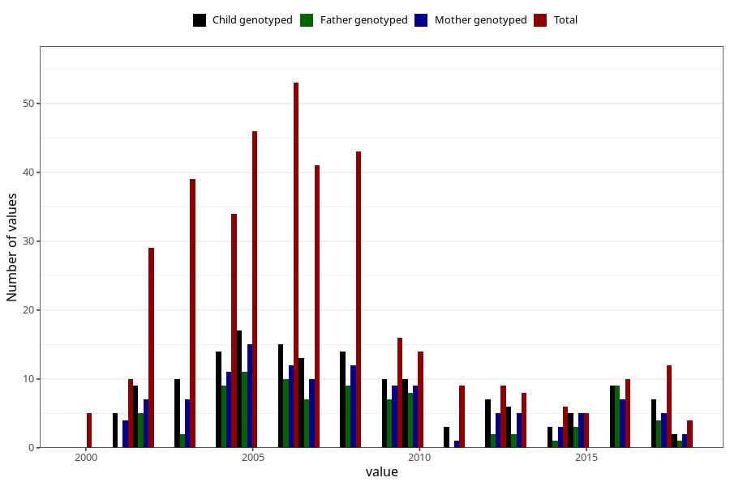

# death_year
Variable mapping to questionnaire: mfr, question DAAR.
- Number of values:

| Value | Total | Child genotyped | Mother genotyped | Father genotyped |
| ----- | ----- | --------------- | ---------------- | ---------------- |
| Missing | 113230 | 83196 | 71640 | 50128 |
| Non-missing | 393 | 159 | 129 | 90 |
| 2000 | 5 | 0 | 0 | 0 |
| 2001 | 10 | 5 | 4 | 0 |
| 2002 | 29 | 9 | 7 | 5 |
| 2003 | 39 | 10 | 7 | 2 |
| 2004 | 34 | 14 | 11 | 9 |
| 2005 | 46 | 17 | 15 | 11 |
| 2006 | 53 | 15 | 12 | 10 |
| 2007 | 41 | 13 | 10 | 7 |
| 2008 | 43 | 14 | 12 | 9 |
| 2009 | 16 | 10 | 9 | 7 |
| 2010 | 14 | 10 | 9 | 8 |
| 2011 | 9 | 3 | 1 | 0 |
| 2012 | 9 | 7 | 5 | 2 |
| 2013 | 8 | 6 | 5 | 2 |
| 2014 | 6 | 3 | 3 | 1 |
| 2015 | 5 | 5 | 5 | 3 |
| 2016 | 10 | 9 | 7 | 9 |
| 2017 | 12 | 7 | 5 | 4 |
| 2018 | 4 | 2 | 2 | 1 |

