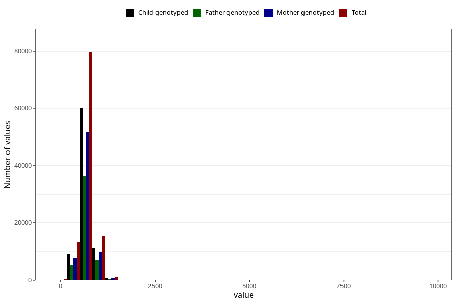

# placenta_weight
Variable mapping to questionnaire: mfr, question PLACENTAVEKT.
- Number of values:

| Value | Total | Child genotyped | Mother genotyped | Father genotyped |
| ----- | ----- | --------------- | ---------------- | ---------------- |
| Missing | 2949 | 1812 | 1513 | 1042 |
| Non-missing | 110674 | 81543 | 70256 | 49176 |
| 25th percentile | 580 | 580 | 585 | 585 |
| 50th percentile | 667 | 670 | 670 | 670 |
| 75th percentile | 775 | 774 | 775 | 775 |

