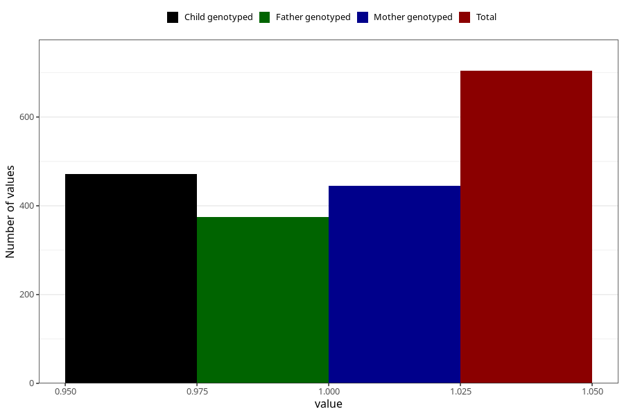

# father_diabetes
Variable mapping to questionnaire: q1f, question FF149.
- Number of values:

| Value | Total | Child genotyped | Mother genotyped | Father genotyped |
| ----- | ----- | --------------- | ---------------- | ---------------- |
| Missing | 112919 | 74960 | 71324 | 49843 |
| Non-missing | 704 | 471 | 445 | 375 |
| 1 | 704 | 471 | 445 | 375 |

