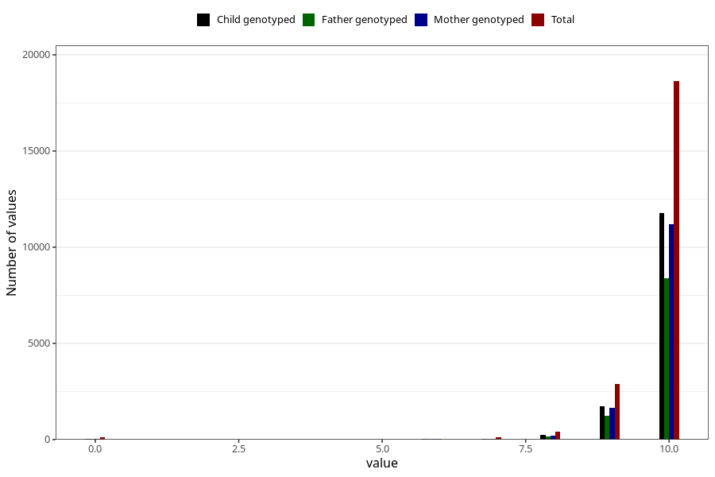

# apgar_10
Variable mapping to questionnaire: mfr, question APGAR10.
- Number of values:

| Value | Total | Child genotyped | Mother genotyped | Father genotyped |
| ----- | ----- | --------------- | ---------------- | ---------------- |
| Missing | 91357 | 68177 | 58619 | 40388 |
| Non-missing | 22266 | 15178 | 13150 | 9830 |
| 0 | 137 | 30 | 27 | 17 |
| 1 | 7 | 1 | 1 | 0 |
| 2 | 5 | 1 | 1 | 1 |
| 3 | 5 | 3 | 3 | 0 |
| 4 | 12 | 2 | 2 | 2 |
| 5 | 14 | 4 | 4 | 3 |
| 6 | 46 | 23 | 17 | 17 |
| 7 | 116 | 64 | 55 | 46 |
| 8 | 402 | 239 | 209 | 160 |
| 9 | 2895 | 1899 | 1648 | 1217 |
| 10 | 18627 | 12912 | 11183 | 8367 |

