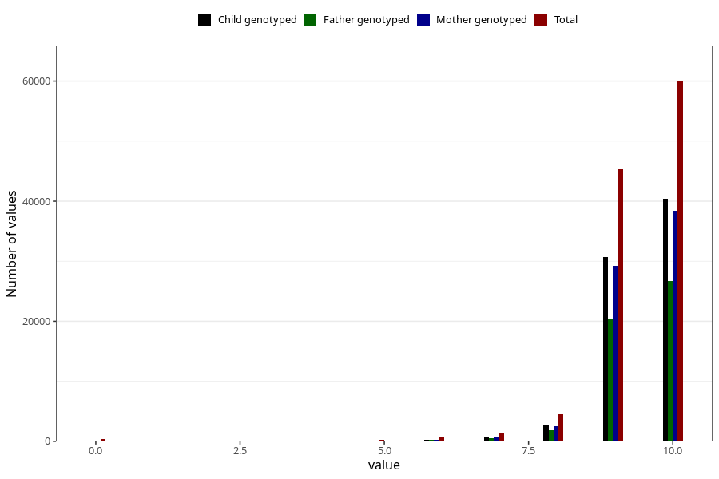

# apgar_5
Variable mapping to questionnaire: mfr, question APGAR5.
- Number of values:

| Value | Total | Child genotyped | Mother genotyped | Father genotyped |
| ----- | ----- | --------------- | ---------------- | ---------------- |
| Missing | 483 | 71 | 70 | 43 |
| Non-missing | 113140 | 75360 | 71699 | 50175 |
| 0 | 447 | 55 | 53 | 37 |
| 1 | 44 | 10 | 10 | 5 |
| 2 | 44 | 10 | 10 | 9 |
| 3 | 106 | 36 | 32 | 22 |
| 4 | 161 | 84 | 82 | 61 |
| 5 | 293 | 130 | 119 | 91 |
| 6 | 636 | 312 | 298 | 218 |
| 7 | 1445 | 788 | 750 | 534 |
| 8 | 4688 | 2840 | 2685 | 1963 |
| 9 | 45358 | 30740 | 29267 | 20489 |
| 10 | 59918 | 40355 | 38393 | 26746 |

