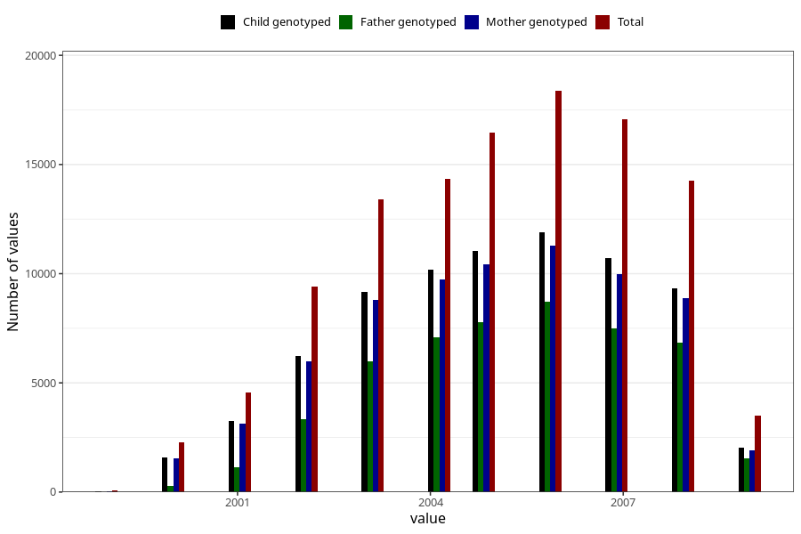

# birth_year
Variable mapping to questionnaire: mfr, question FAAR.
- Number of values:

| Value | Total | Child genotyped | Mother genotyped | Father genotyped |
| ----- | ----- | --------------- | ---------------- | ---------------- |
| Missing | 0 | 0 | 0 | 0 |
| Non-missing | 113623 | 83355 | 71769 | 50218 |
| 1999 | 60 | 29 | 26 | 6 |
| 2000 | 2284 | 1732 | 1546 | 279 |
| 2001 | 4555 | 3549 | 3152 | 1127 |
| 2002 | 9391 | 6884 | 5996 | 3336 |
| 2003 | 13386 | 10109 | 8780 | 5985 |
| 2004 | 14330 | 11242 | 9754 | 7097 |
| 2005 | 16446 | 12301 | 10443 | 7792 |
| 2006 | 18368 | 13164 | 11266 | 8729 |
| 2007 | 17078 | 11896 | 9979 | 7484 |
| 2008 | 14242 | 10220 | 8898 | 6855 |
| 2009 | 3483 | 2229 | 1929 | 1528 |

