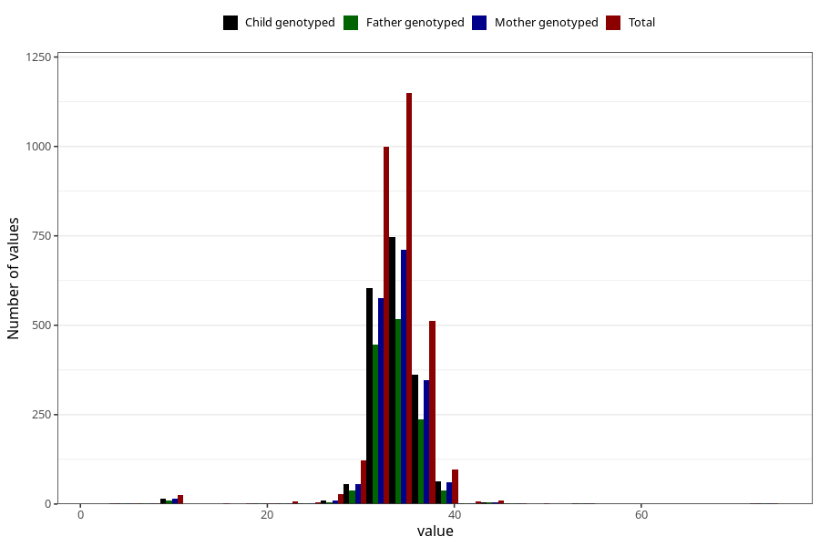

# crown_rump_length
Variable mapping to questionnaire: mfr, question SETE_ISSE.
- Number of values:

| Value | Total | Child genotyped | Mother genotyped | Father genotyped |
| ----- | ----- | --------------- | ---------------- | ---------------- |
| Missing | 110648 | 81296 | 69976 | 48912 |
| Non-missing | 2975 | 2059 | 1793 | 1306 |
| 25th percentile | 33 | 33 | 33 | 33 |
| 50th percentile | 34 | 34 | 34 | 34 |
| 75th percentile | 35 | 35 | 35 | 35 |

