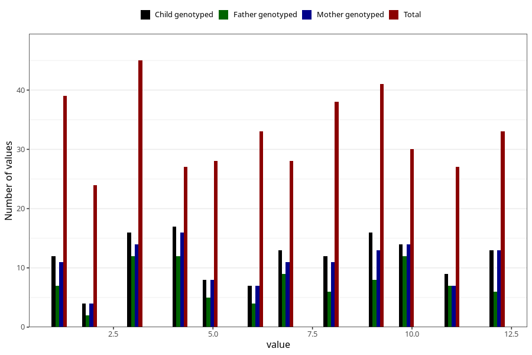

# month_death_child
Variable mapping to questionnaire: mfr, question DMND.
- Number of values:

| Value | Total | Child genotyped | Mother genotyped | Father genotyped |
| ----- | ----- | --------------- | ---------------- | ---------------- |
| Missing | 113230 | 83196 | 71640 | 50128 |
| Non-missing | 393 | 159 | 129 | 90 |
| 1 | 39 | 13 | 11 | 7 |
| 2 | 24 | 5 | 4 | 2 |
| 3 | 45 | 19 | 14 | 12 |
| 4 | 27 | 18 | 16 | 12 |
| 5 | 28 | 10 | 8 | 5 |
| 6 | 33 | 9 | 7 | 4 |
| 7 | 28 | 13 | 11 | 9 |
| 8 | 38 | 12 | 11 | 6 |
| 9 | 41 | 20 | 13 | 8 |
| 10 | 30 | 16 | 14 | 12 |
| 11 | 27 | 11 | 7 | 7 |
| 12 | 33 | 13 | 13 | 6 |

