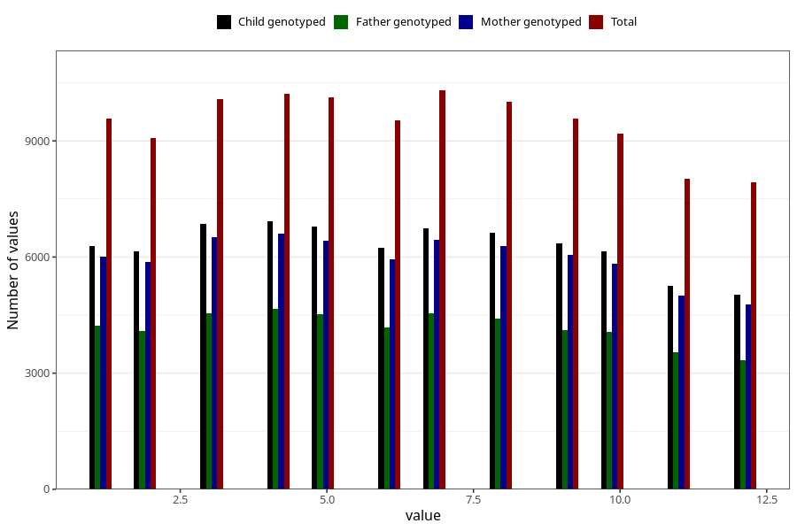

# month_of_delivery
Variable mapping to questionnaire: mfr, question FMND.
- Number of values:

| Value | Total | Child genotyped | Mother genotyped | Father genotyped |
| ----- | ----- | --------------- | ---------------- | ---------------- |
| Missing | 0 | 0 | 0 | 0 |
| Non-missing | 113623 | 83355 | 71769 | 50218 |
| 1 | 9579 | 6963 | 6011 | 4230 |
| 2 | 9068 | 6752 | 5866 | 4090 |
| 3 | 10083 | 7524 | 6511 | 4553 |
| 4 | 10207 | 7646 | 6610 | 4656 |
| 5 | 10135 | 7446 | 6421 | 4523 |
| 6 | 9526 | 6921 | 5947 | 4174 |
| 7 | 10303 | 7486 | 6454 | 4551 |
| 8 | 10007 | 7315 | 6289 | 4408 |
| 9 | 9585 | 7025 | 6057 | 4119 |
| 10 | 9182 | 6859 | 5823 | 4057 |
| 11 | 8027 | 5843 | 5009 | 3533 |
| 12 | 7921 | 5575 | 4771 | 3324 |

