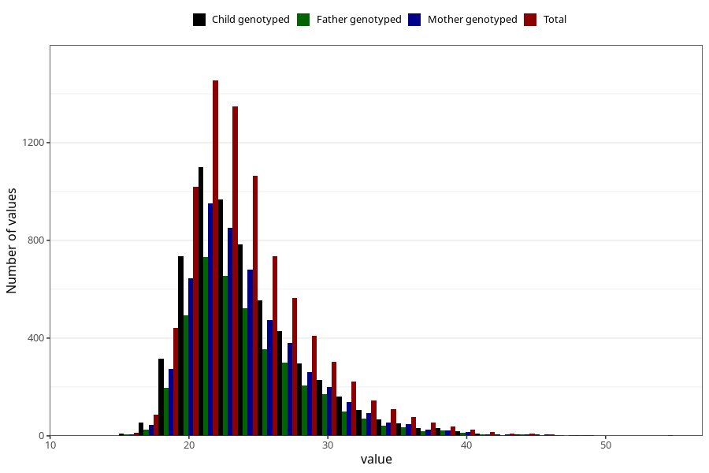

# mother_bmi_before
Variable mapping to questionnaire: mfr, question KMI_FOER.
- Number of values:

| Value | Total | Child genotyped | Mother genotyped | Father genotyped |
| ----- | ----- | --------------- | ---------------- | ---------------- |
| Missing | 105464 | 77379 | 66573 | 46235 |
| Non-missing | 8159 | 5976 | 5196 | 3983 |
| 25th percentile | 21.155 | 21.1975 | 21.22 | 21.26 |
| 50th percentile | 23.15 | 23.15 | 23.15 | 23.23 |
| 75th percentile | 26.24 | 26.23 | 26.2525 | 26.37 |

