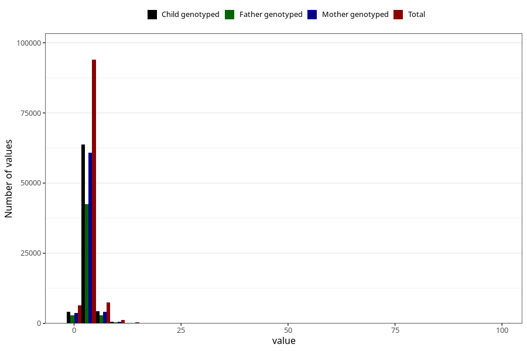

# mother_days_hospital_birth
Variable mapping to questionnaire: mfr, question LIGGEDOGN_MOR.
- Number of values:

| Value | Total | Child genotyped | Mother genotyped | Father genotyped |
| ----- | ----- | --------------- | ---------------- | ---------------- |
| Missing | 3872 | 2479 | 2056 | 1547 |
| Non-missing | 109751 | 80876 | 69713 | 48671 |
| 25th percentile | 3 | 3 | 3 | 2 |
| 50th percentile | 3 | 3 | 3 | 3 |
| 75th percentile | 4 | 4 | 4 | 4 |

