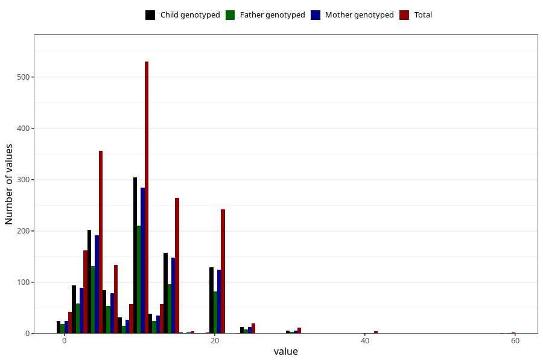

# mother_smoking_before_pregnancy_cigarettes_per_day
Variable mapping to questionnaire: mfr, question ROYK_FOER_ANT.
- Number of values:

| Value | Total | Child genotyped | Mother genotyped | Father genotyped |
| ----- | ----- | --------------- | ---------------- | ---------------- |
| Missing | 111731 | 74339 | 70743 | 49513 |
| Non-missing | 1892 | 1092 | 1026 | 705 |
| 25th percentile | 5 | 5 | 5 | 5 |
| 50th percentile | 10 | 10 | 10 | 10 |
| 75th percentile | 15 | 15 | 15 | 15 |

