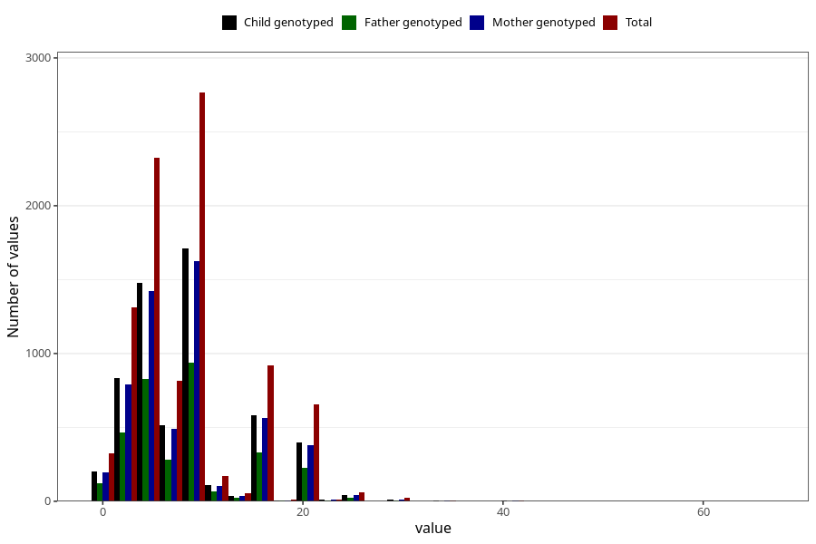

# mother_smoking_beginning_cigarettes_per_day
Variable mapping to questionnaire: mfr, question ROYK_BEG_ANT.
- Number of values:

| Value | Total | Child genotyped | Mother genotyped | Father genotyped |
| ----- | ----- | --------------- | ---------------- | ---------------- |
| Missing | 104155 | 76793 | 66087 | 46886 |
| Non-missing | 9468 | 6562 | 5682 | 3332 |
| 25th percentile | 5 | 5 | 5 | 5 |
| 50th percentile | 7 | 7 | 7 | 7 |
| 75th percentile | 10 | 10 | 10 | 10 |

