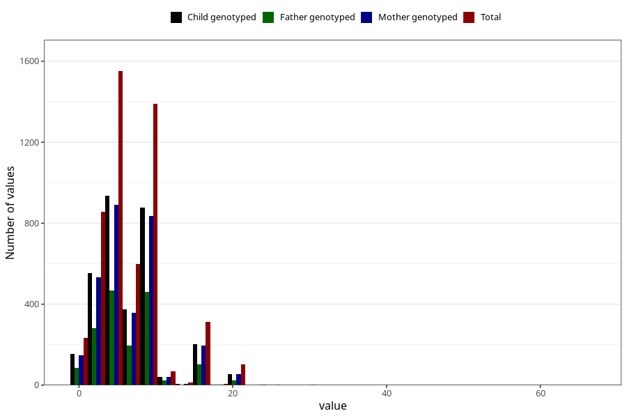

# mother_smoking_end_cigarettes_per_day
Variable mapping to questionnaire: mfr, question ROYK_AVSL_ANT.
- Number of values:

| Value | Total | Child genotyped | Mother genotyped | Father genotyped |
| ----- | ----- | --------------- | ---------------- | ---------------- |
| Missing | 108476 | 79829 | 68702 | 48573 |
| Non-missing | 5147 | 3526 | 3067 | 1645 |
| 25th percentile | 4 | 4 | 4 | 4 |
| 50th percentile | 5 | 5 | 5 | 5 |
| 75th percentile | 10 | 10 | 10 | 10 |

