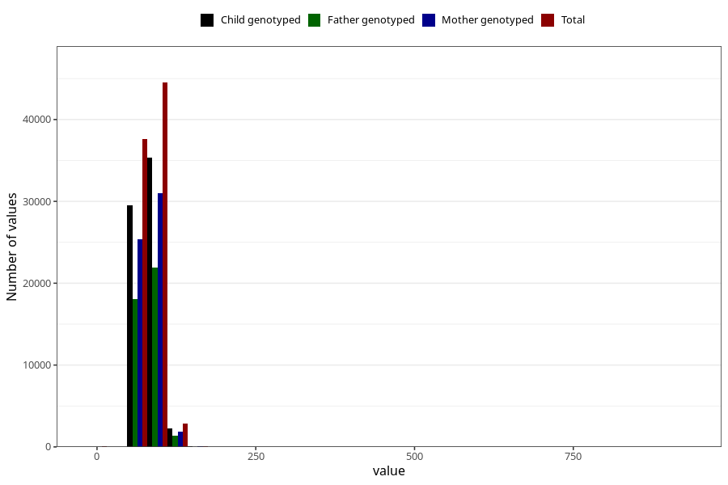

# mother_weight_end
Variable mapping to questionnaire: mfr, question MORS_VEKT_SLUTT.
- Number of values:

| Value | Total | Child genotyped | Mother genotyped | Father genotyped |
| ----- | ----- | --------------- | ---------------- | ---------------- |
| Missing | 28496 | 14136 | 13405 | 8865 |
| Non-missing | 85127 | 61295 | 58364 | 41353 |
| 25th percentile | 73.5 | 74 | 74 | 74 |
| 50th percentile | 81 | 81 | 81 | 81 |
| 75th percentile | 90 | 90 | 90 | 90 |

