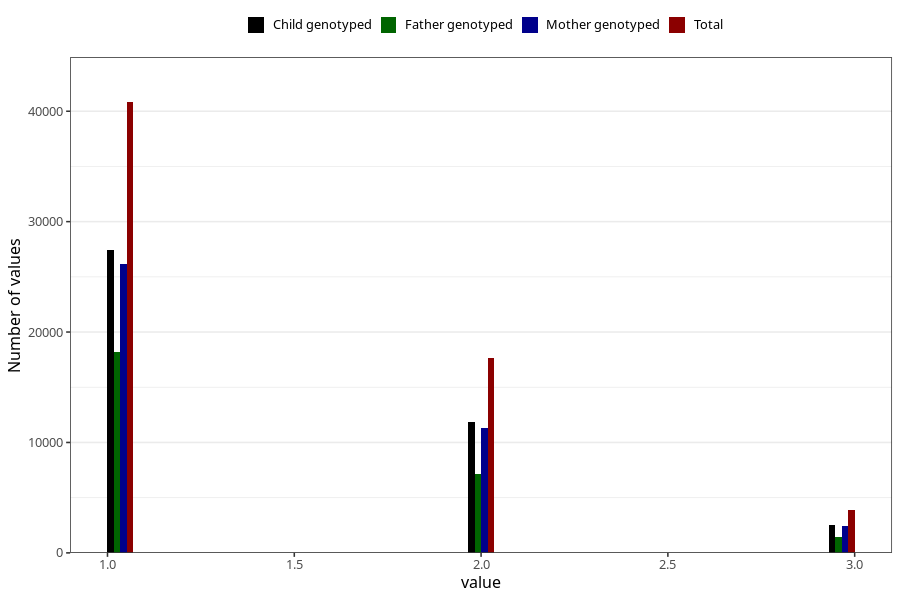

# n_previous_deliveries
Variable mapping to questionnaire: mfr, question PARITET_5.
- Number of values:

| Value | Total | Child genotyped | Mother genotyped | Father genotyped |
| ----- | ----- | --------------- | ---------------- | ---------------- |
| Missing | 0 | 0 | 0 | 0 |
| Non-missing | 113623 | 75431 | 71769 | 50218 |
| 0 (primiparous) | 49990 | 32886 | 31207 |23119 |
| 4 or more | 1240 | 747 | 713 |367 |
| 1 | 40819 | 27431 | 26132 | 18197 |
| 2 | 17666 | 11853 | 11314 | 7137 |
| 3 | 3908 | 2514 | 2403 | 1398 |

