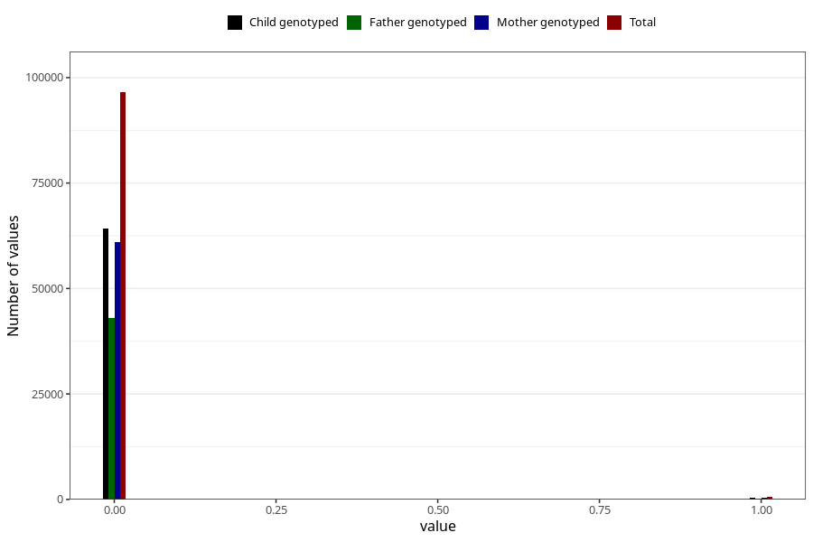

# n_previous_stillbirths
Variable mapping to questionnaire: mfr, question DODFODTE_3.
- Number of values:

| Value | Total | Child genotyped | Mother genotyped | Father genotyped |
| ----- | ----- | --------------- | ---------------- | ---------------- |
| Missing | 16490 | 11927 | 10389 | 6999 |
| Non-missing | 97133 | 71428 | 61380 | 43219 |
| 2 or more | 39 | 23 | 15 |8 |
| 0 | 96510 | 71021 | 61042 | 43020 |
| 1 | 584 | 384 | 323 | 191 |

