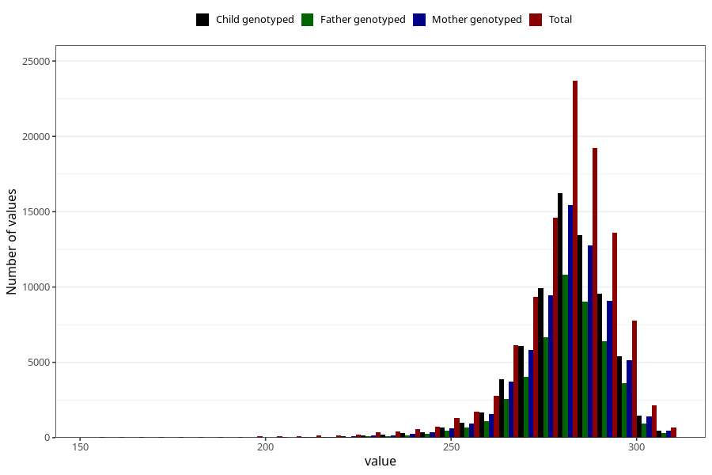

# pregnancy_duration_mens
Variable mapping to questionnaire: mfr, question SVLEN_SM_DG.
- Number of values:

| Value | Total | Child genotyped | Mother genotyped | Father genotyped |
| ----- | ----- | --------------- | ---------------- | ---------------- |
| Missing | 7343 | 4842 | 4125 | 2817 |
| Non-missing | 106280 | 78513 | 67644 | 47401 |
| 25th percentile | 274 | 275 | 275 | 275 |
| 50th percentile | 282 | 283 | 283 | 283 |
| 75th percentile | 289 | 289 | 289 | 289 |

