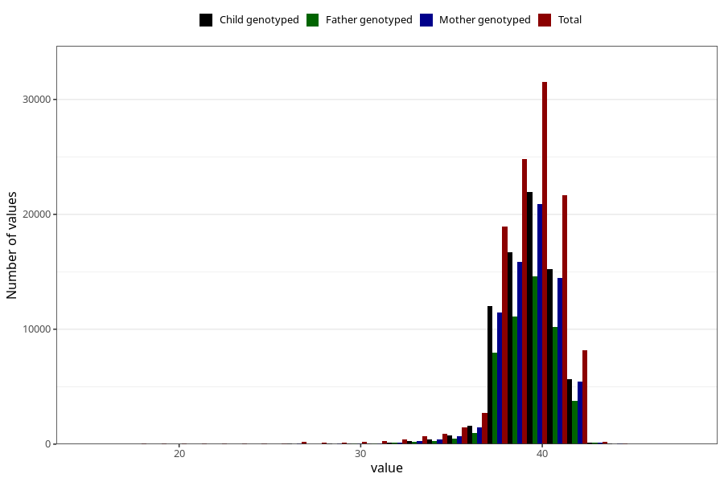

# pregnancy_duration_weeks
Variable mapping to questionnaire: mfr, question SVLEN.
- Number of values:

| Value | Total | Child genotyped | Mother genotyped | Father genotyped |
| ----- | ----- | --------------- | ---------------- | ---------------- |
| Missing | 486 | 273 | 264 | 178 |
| Non-missing | 113137 | 75158 | 71505 | 50040 |
| 25th percentile | 39 | 39 | 39 | 39 |
| 50th percentile | 40 | 40 | 40 | 40 |
| 75th percentile | 41 | 41 | 41 | 41 |

