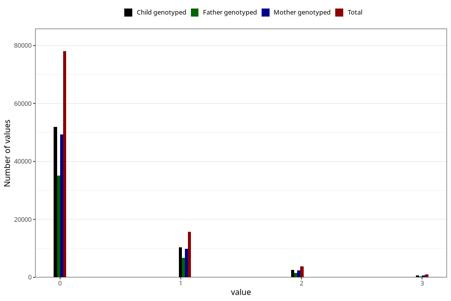

# previous_miscarriages_before_12w
Variable mapping to questionnaire: mfr, question SPABORT_12_5.
- Number of values:

| Value | Total | Child genotyped | Mother genotyped | Father genotyped |
| ----- | ----- | --------------- | ---------------- | ---------------- |
| Missing | 14549 | 9573 | 9173 | 6207 |
| Non-missing | 99074 | 65858 | 62596 | 44011 |
| 4 or more | 551 | 360 | 333 |216 |
| 0 | 78014 | 51953 | 49357 | 35078 |
| 1 | 15758 | 10386 | 9899 | 6742 |
| 2 | 3746 | 2497 | 2375 | 1575 |
| 3 | 1005 | 662 | 632 | 400 |

