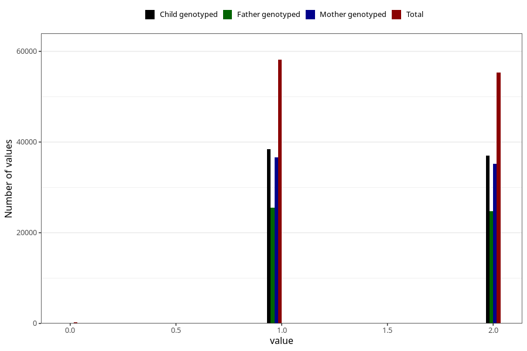

# sex
Variable mapping to questionnaire: mfr, question KJONN.
- Number of values:

| Value | Total | Child genotyped | Mother genotyped | Father genotyped |
| ----- | ----- | --------------- | ---------------- | ---------------- |
| Missing | 0 | 0 | 0 | 0 |
| Non-missing | 113623 | 75431 | 71769 | 50218 |
| 0 | 214 | 0 | 0 | 0 |
| 1 | 58133 | 38433 | 36563 | 25473 |
| 2 | 55276 | 36998 | 35206 | 24745 |

