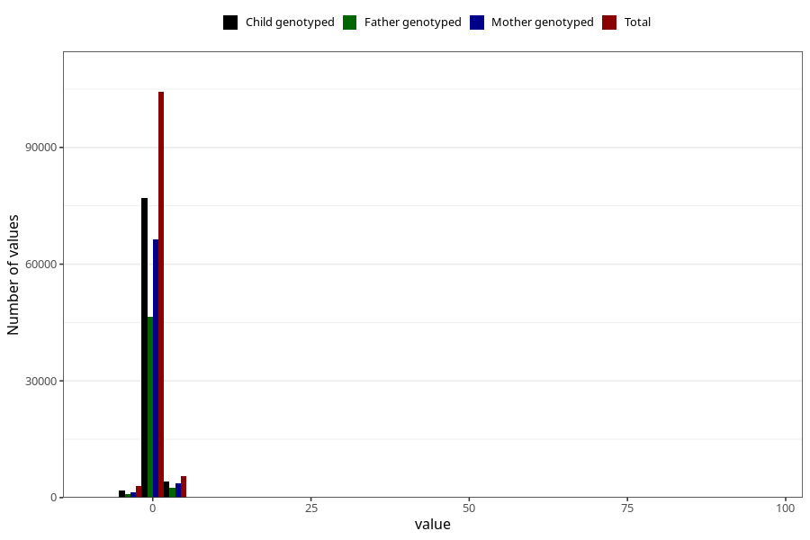

# weight_birth_z_ga
Variable mapping to questionnaire: mfr, question ZSCORE_BW_GA.
- Number of values:

| Value | Total | Child genotyped | Mother genotyped | Father genotyped |
| ----- | ----- | --------------- | ---------------- | ---------------- |
| Missing | 739 | 328 | 286 | 192 |
| Non-missing | 112884 | 83027 | 71483 | 50026 |
| 25th percentile | -0.58 | -0.54 | -0.52 | -0.52 |
| 50th percentile | 0.05 | 0.09 | 0.1 | 0.1 |
| 75th percentile | 0.72 | 0.74 | 0.76 | 0.74 |

