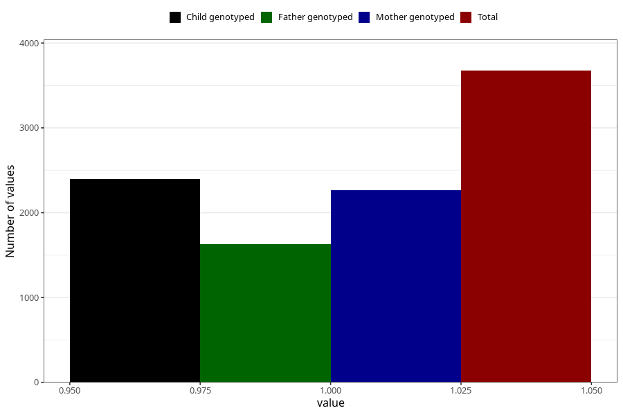

# anxiety_before
Variable mapping to questionnaire: q1m, question AA878.
- Number of values:

| Value | Total | Child genotyped | Mother genotyped | Father genotyped |
| ----- | ----- | --------------- | ---------------- | ---------------- |
| Missing | 109949 | 80662 | 69503 | 48590 |
| Non-missing | 3674 | 2693 | 2266 | 1628 |
| 1 | 3674 | 2693 | 2266 | 1628 |

