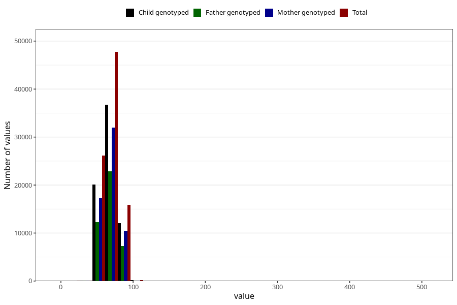

# blood_pressure_15w_diastolic
Variable mapping to questionnaire: q1m, question AA84.
- Number of values:

| Value | Total | Child genotyped | Mother genotyped | Father genotyped |
| ----- | ----- | --------------- | ---------------- | ---------------- |
| Missing | 23290 | 12334 | 11694 | 7544 |
| Non-missing | 90333 | 63097 | 60075 | 42674 |
| 25th percentile | 60 | 60 | 60 | 60 |
| 50th percentile | 70 | 70 | 70 | 70 |
| 75th percentile | 75 | 75 | 75 | 75 |

