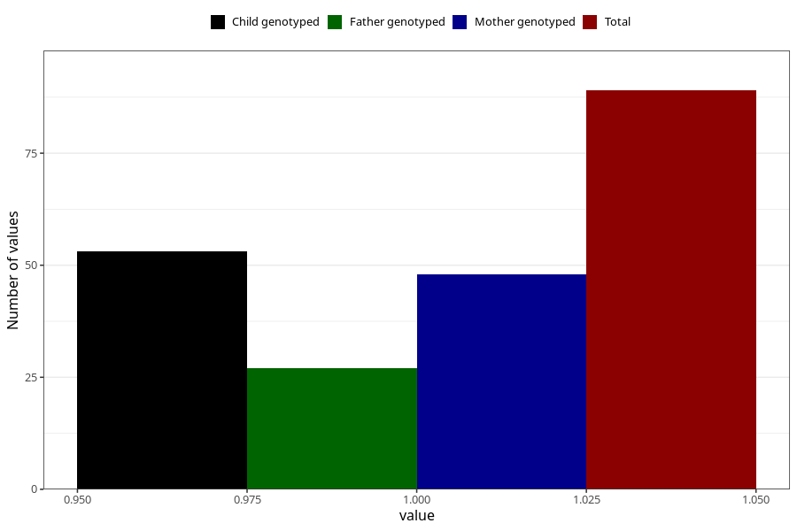

# cocaine_before
Variable mapping to questionnaire: q1m, question AA1446.
- Number of values:

| Value | Total | Child genotyped | Mother genotyped | Father genotyped |
| ----- | ----- | --------------- | ---------------- | ---------------- |
| Missing | 113534 | 75378 | 71721 | 50191 |
| Non-missing | 89 | 53 | 48 | 27 |
| 1 | 89 | 53 | 48 | 27 |

