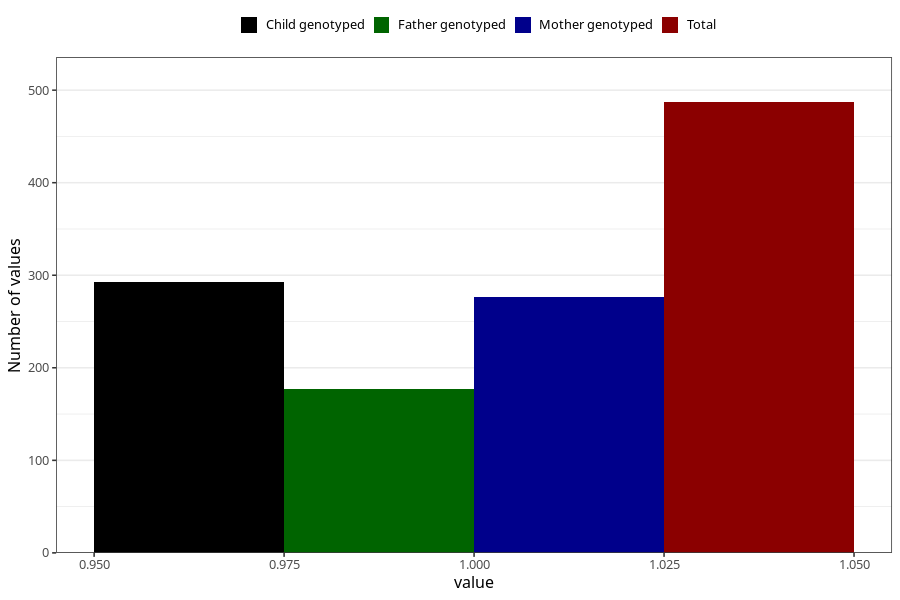

# hash_before
Variable mapping to questionnaire: q1m, question AA1434.
- Number of values:

| Value | Total | Child genotyped | Mother genotyped | Father genotyped |
| ----- | ----- | --------------- | ---------------- | ---------------- |
| Missing | 113136 | 75138 | 71492 | 50041 |
| Non-missing | 487 | 293 | 277 | 177 |
| 1 | 487 | 293 | 277 | 177 |

