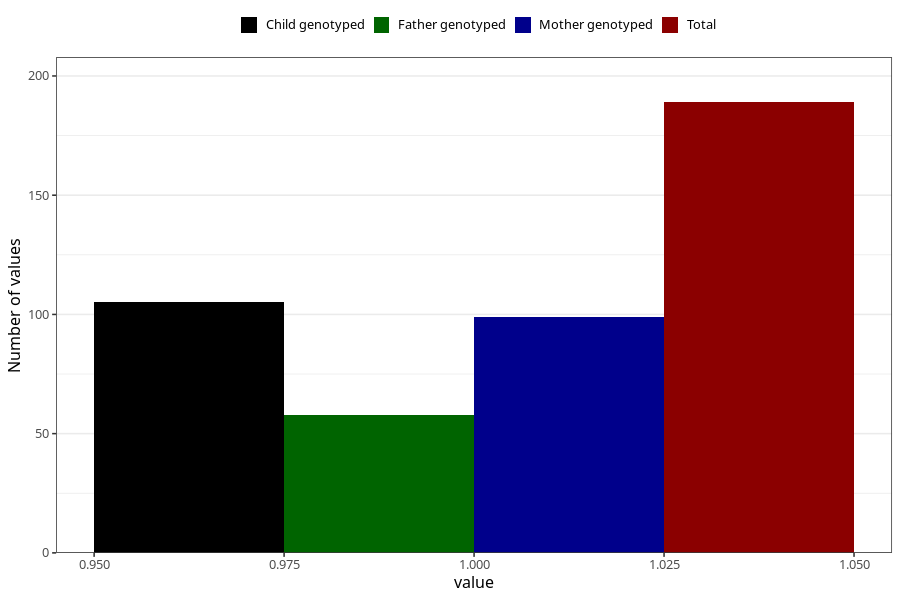

# hash_during
Variable mapping to questionnaire: q1m, question AA1435.
- Number of values:

| Value | Total | Child genotyped | Mother genotyped | Father genotyped |
| ----- | ----- | --------------- | ---------------- | ---------------- |
| Missing | 113434 | 83231 | 71670 | 50160 |
| Non-missing | 189 | 124 | 99 | 58 |
| 1 | 189 | 124 | 99 | 58 |

