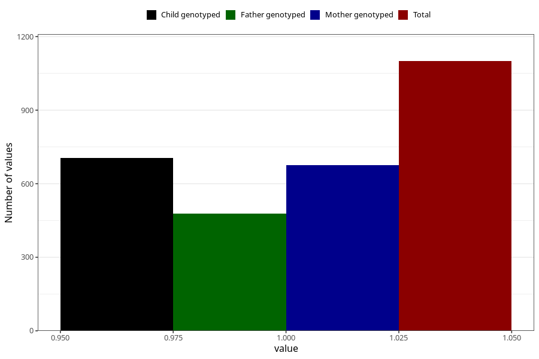

# highest_blood_pressure_before_pregnancy
Variable mapping to questionnaire: q1m, question AA554.
- Number of values:

| Value | Total | Child genotyped | Mother genotyped | Father genotyped |
| ----- | ----- | --------------- | ---------------- | ---------------- |
| Missing | 112523 | 74727 | 71094 | 49739 |
| Non-missing | 1100 | 704 | 675 | 479 |
| 1 | 1100 | 704 | 675 | 479 |

