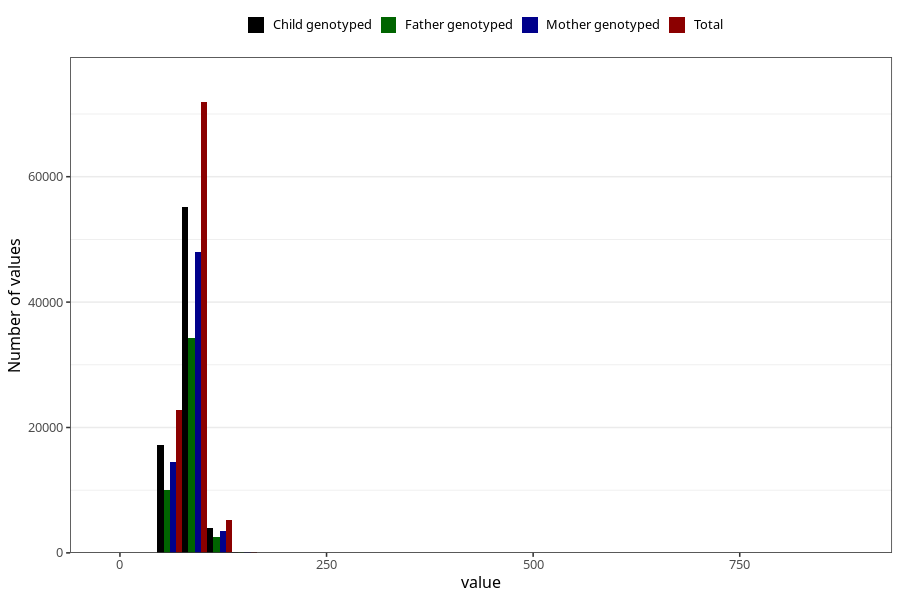

# father_weight
Variable mapping to questionnaire: q1m, question AA89.
- Number of values:

| Value | Total | Child genotyped | Mother genotyped | Father genotyped |
| ----- | ----- | --------------- | ---------------- | ---------------- |
| Missing | 13431 | 6902 | 5690 | 3253 |
| Non-missing | 100192 | 76453 | 66079 | 46965 |
| 25th percentile | 77 | 77 | 77 | 77 |
| 50th percentile | 84 | 84 | 85 | 85 |
| 75th percentile | 92 | 92 | 92 | 92 |

