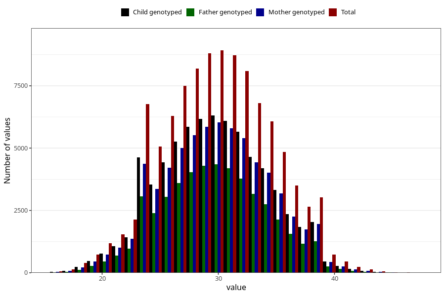

# mother_age_15w
Variable mapping to questionnaire: q1m, question MOR_ALDERUTFYLT_S1.
- Number of values:

| Value | Total | Child genotyped | Mother genotyped | Father genotyped |
| ----- | ----- | --------------- | ---------------- | ---------------- |
| Missing | 10478 | 4670 | 3785 | 2268 |
| Non-missing | 103145 | 78685 | 67984 | 47950 |
| 25th percentile | 27 | 27 | 27 | 27 |
| 50th percentile | 30 | 30 | 30 | 30 |
| 75th percentile | 33 | 33 | 33 | 33 |

