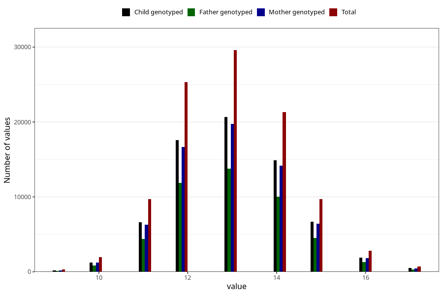

# mother_age_at_menarche
Variable mapping to questionnaire: q1m, question AA12.
- Number of values:

| Value | Total | Child genotyped | Mother genotyped | Father genotyped |
| ----- | ----- | --------------- | ---------------- | ---------------- |
| Missing | 12159 | 5905 | 4824 | 2992 |
| Non-missing | 101464 | 77450 | 66945 | 47226 |
| 9 | 326 | 236 | 186 | 135 |
| 10 | 1932 | 1450 | 1206 | 853 |
| 11 | 9732 | 7396 | 6314 | 4389 |
| 12 | 25356 | 19374 | 16670 | 11899 |
| 13 | 29577 | 22630 | 19713 | 13789 |
| 14 | 21324 | 16281 | 14176 | 10057 |
| 15 | 9679 | 7419 | 6399 | 4514 |
| 16 | 2833 | 2124 | 1820 | 1274 |
| 17 | 705 | 540 | 461 | 316 |

