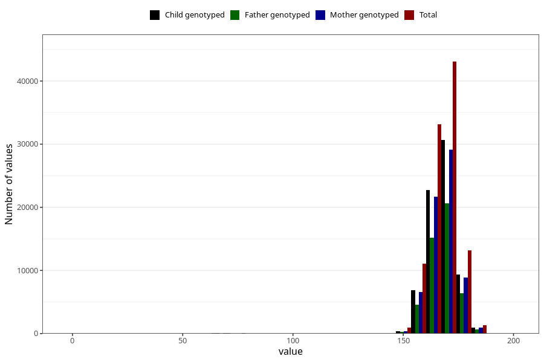

# mother_height
Variable mapping to questionnaire: mfr, question MORS_HOYDE.
- Number of values:

| Value | Total | Child genotyped | Mother genotyped | Father genotyped |
| ----- | ----- | --------------- | ---------------- | ---------------- |
| Missing | 10508 | 4279 | 4057 | 2424 |
| Non-missing | 103115 | 71152 | 67712 | 47794 |
| 25th percentile | 164 | 164 | 164 | 164 |
| 50th percentile | 168 | 168 | 168 | 168 |
| 75th percentile | 172 | 172 | 172 | 172 |

