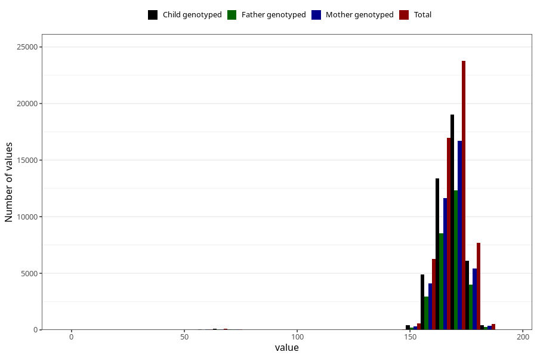

# mother_height_3y
Variable mapping to questionnaire: q6, question GG502.
- Number of values:

| Value | Total | Child genotyped | Mother genotyped | Father genotyped |
| ----- | ----- | --------------- | ---------------- | ---------------- |
| Missing | 57529 | 38862 | 33040 | 21778 |
| Non-missing | 56094 | 44493 | 38729 | 28440 |
| 25th percentile | 164 | 164 | 164 | 164 |
| 50th percentile | 168 | 168 | 168 | 168 |
| 75th percentile | 172 | 172 | 172 | 172 |

