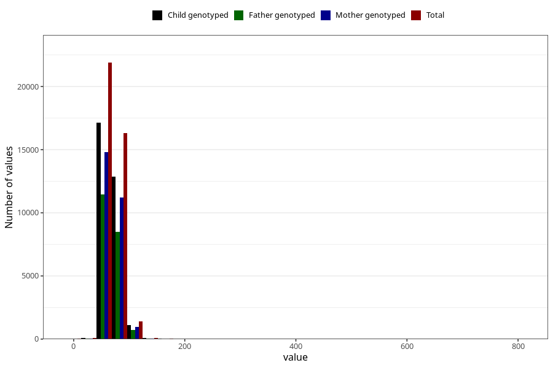

# mother_weight_5y
Variable mapping to questionnaire: q7, question LL339.
- Number of values:

| Value | Total | Child genotyped | Mother genotyped | Father genotyped |
| ----- | ----- | --------------- | ---------------- | ---------------- |
| Missing | 73743 | 46795 | 44641 | 29460 |
| Non-missing | 39880 | 28636 | 27128 | 20758 |
| 25th percentile | 60.8 | 61 | 61 | 61 |
| 50th percentile | 67 | 67.4 | 67.2 | 67 |
| 75th percentile | 75.5 | 75.5 | 75.5 | 75 |

