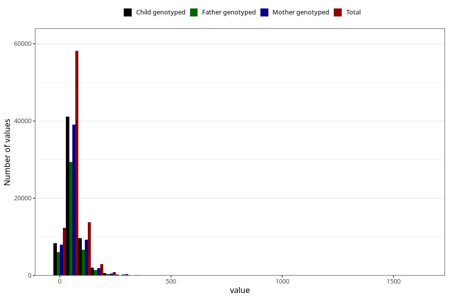

# added_sugar
Variable mapping to questionnaire: q2_cwd_calculations, question SUKKER.
- Number of values:

| Value | Total | Child genotyped | Mother genotyped | Father genotyped |
| ----- | ----- | --------------- | ---------------- | ---------------- |
| Missing | 24927 | 14790 | 12674 | 6238 |
| Non-missing | 88696 | 68565 | 59095 | 43980 |
| 25th percentile | 35.98 | 36.14 | 36.29 | 36.0775 |
| 50th percentile | 52.79 | 52.93 | 52.98 | 52.44 |
| 75th percentile | 76.95 | 76.94 | 76.84 | 75.72 |

