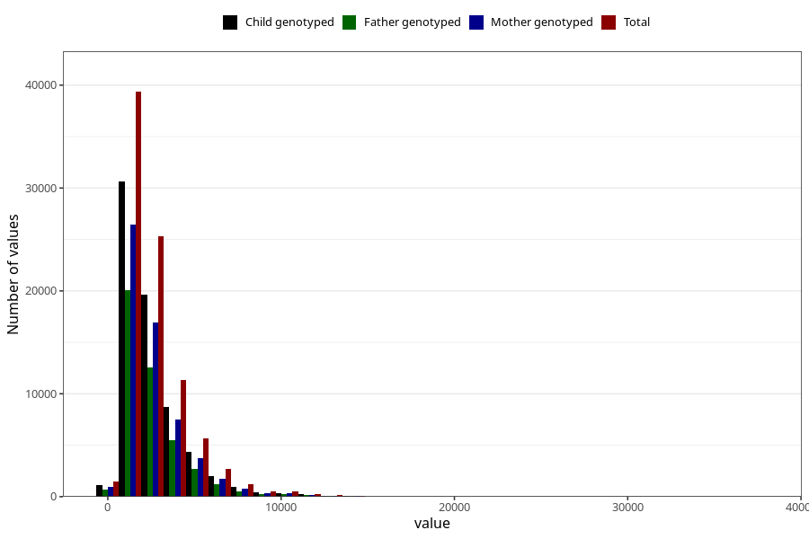

# beta_carotene
Variable mapping to questionnaire: q2_cwd_calculations, question BETAKAROTEN.
- Number of values:

| Value | Total | Child genotyped | Mother genotyped | Father genotyped |
| ----- | ----- | --------------- | ---------------- | ---------------- |
| Missing | 24927 | 13198 | 12674 | 6238 |
| Non-missing | 88696 | 62233 | 59095 | 43980 |
| 25th percentile | 1455.1775 | 1451.57 | 1452.195 | 1443.885 |
| 50th percentile | 2047.43 | 2036.54 | 2036.94 | 2017.41 |
| 75th percentile | 3254.445 | 3223.5 | 3225.165 | 3191.26 |

