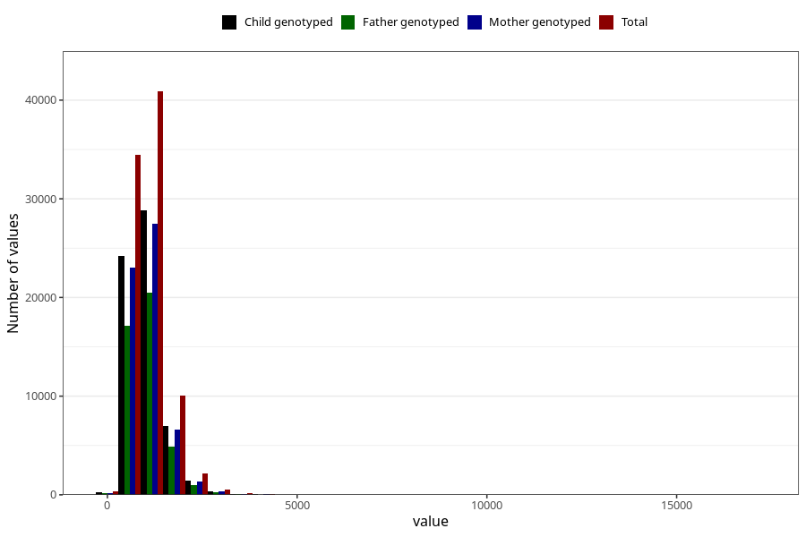

# calsium
Variable mapping to questionnaire: q2_cwd_calculations, question KALSIUM.
- Number of values:

| Value | Total | Child genotyped | Mother genotyped | Father genotyped |
| ----- | ----- | --------------- | ---------------- | ---------------- |
| Missing | 24927 | 14790 | 12674 | 6238 |
| Non-missing | 88696 | 68565 | 59095 | 43980 |
| 25th percentile | 750.9975 | 750.76 | 751.92 | 751.93 |
| 50th percentile | 979.355 | 977.08 | 977.08 | 975.585 |
| 75th percentile | 1270.9175 | 1266.65 | 1265.055 | 1260.0425 |

