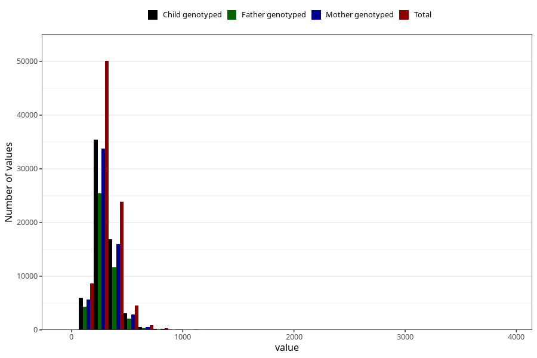

# carbohydrates
Variable mapping to questionnaire: q2_cwd_calculations, question TOT_KARB.
- Number of values:

| Value | Total | Child genotyped | Mother genotyped | Father genotyped |
| ----- | ----- | --------------- | ---------------- | ---------------- |
| Missing | 24927 | 14790 | 12674 | 6238 |
| Non-missing | 88696 | 68565 | 59095 | 43980 |
| 25th percentile | 243.52 | 243.68 | 243.8 | 242.88 |
| 50th percentile | 295.93 | 295.9 | 295.71 | 294.35 |
| 75th percentile | 360.19 | 359.24 | 358.575 | 355.5625 |

