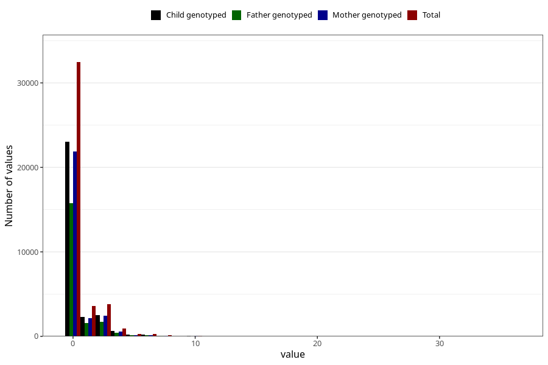

# coffee_before_instant
Variable mapping to questionnaire: q1m, question AA1380.
- Number of values:

| Value | Total | Child genotyped | Mother genotyped | Father genotyped |
| ----- | ----- | --------------- | ---------------- | ---------------- |
| Missing | 72047 | 46456 | 44211 | 30444 |
| Non-missing | 41576 | 28975 | 27558 | 19774 |
| Consumption have been reported by a mark but no amount given | 2 | 0 | 0 |0 |
| 0 | 32455 | 23011 | 21912 | 15733 |
| 1 | 3571 | 2297 | 2184 | 1590 |
| 2 | 3019 | 1996 | 1880 | 1341 |
| 3 | 824 | 547 | 530 | 374 |
| 4 | 937 | 620 | 581 | 414 |
| 5 | 277 | 180 | 166 | 112 |
| 6 | 270 | 175 | 167 | 112 |
| 7 | 26 | 16 | 16 | 13 |
| 8 | 100 | 74 | 67 | 49 |
| 9 | 4 | 2 | 2 | 2 |
| 10 | 68 | 43 | 41 | 26 |
| 12 | 14 | 6 | 6 | 3 |
| 14 | 2 | 2 | 2 | 2 |
| 15 | 4 | 3 | 1 | 2 |
| 16 | 1 | 1 | 1 | 1 |
| 24 | 1 | 1 | 1 | 0 |
| 36 | 1 | 1 | 1 | 0 |

