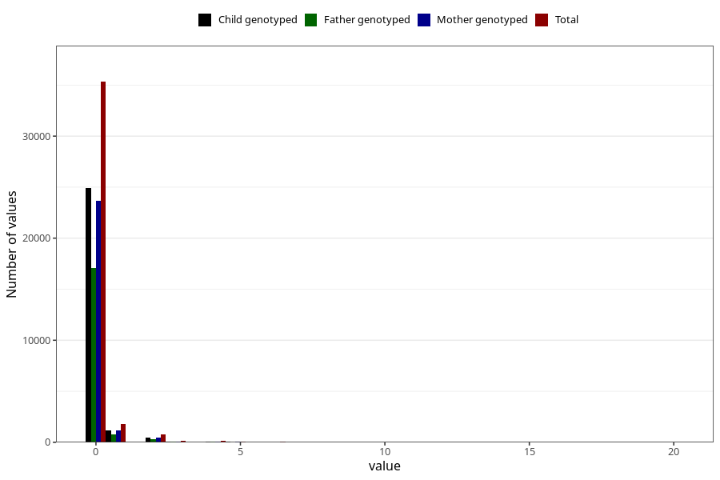

# coffee_during_boiled
Variable mapping to questionnaire: q1m, question AA1384.
- Number of values:

| Value | Total | Child genotyped | Mother genotyped | Father genotyped |
| ----- | ----- | --------------- | ---------------- | ---------------- |
| Missing | 75330 | 48573 | 46199 | 31873 |
| Non-missing | 38293 | 26858 | 25570 | 18345 |
| Consumption have been reported by a mark but no amount given | 3 | 1 | 1 |0 |
| 0 | 35326 | 24890 | 23695 | 17064 |
| 1 | 1780 | 1184 | 1138 | 811 |
| 2 | 735 | 484 | 460 | 297 |
| 3 | 155 | 105 | 97 | 64 |
| 4 | 134 | 94 | 89 | 53 |
| 5 | 60 | 42 | 36 | 24 |
| 6 | 44 | 28 | 28 | 20 |
| 7 | 10 | 6 | 4 | 2 |
| 8 | 19 | 8 | 8 | 2 |
| 10 | 21 | 11 | 9 | 6 |
| 12 | 3 | 2 | 2 | 0 |
| 15 | 1 | 1 | 1 | 1 |
| 16 | 1 | 1 | 1 | 1 |
| 20 | 1 | 1 | 1 | 0 |

