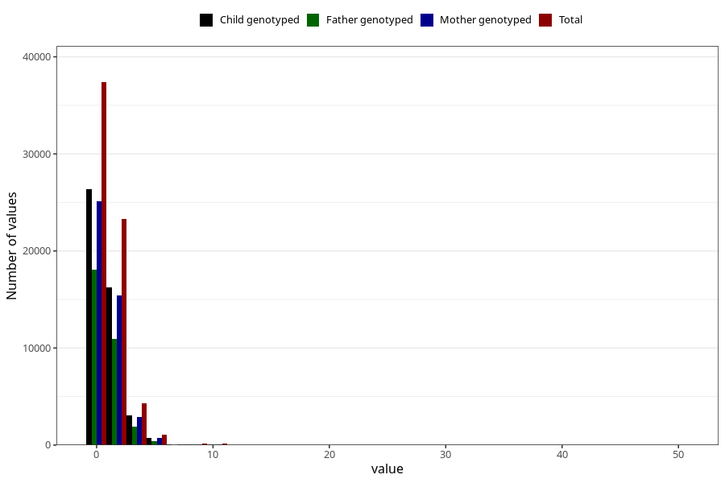

# coffee_during_filter
Variable mapping to questionnaire: q1m, question AA1378.
- Number of values:

| Value | Total | Child genotyped | Mother genotyped | Father genotyped |
| ----- | ----- | --------------- | ---------------- | ---------------- |
| Missing | 47277 | 32522 | 27358 | 18805 |
| Non-missing | 66346 | 50833 | 44411 | 31413 |
| Consumption have been reported by a mark but no amount given | 1 | 0 | 0 |0 |
| 0 | 37378 | 28770 | 25111 | 18036 |
| 1 | 14057 | 10707 | 9328 | 6745 |
| 2 | 9202 | 6993 | 6117 | 4224 |
| 3 | 2449 | 1877 | 1645 | 1046 |
| 4 | 1845 | 1443 | 1270 | 826 |
| 5 | 578 | 434 | 387 | 235 |
| 6 | 471 | 353 | 322 | 179 |
| 7 | 56 | 40 | 36 | 24 |
| 8 | 146 | 105 | 96 | 53 |
| 9 | 5 | 5 | 5 | 2 |
| 10 | 116 | 74 | 65 | 31 |
| 12 | 24 | 20 | 19 | 7 |
| 14 | 2 | 1 | 1 | 1 |
| 15 | 4 | 1 | 1 | 1 |
| 16 | 2 | 2 | 2 | 0 |
| 20 | 7 | 6 | 5 | 3 |
| 25 | 1 | 1 | 0 | 0 |
| 30 | 1 | 0 | 0 | 0 |
| 50 | 1 | 1 | 1 | 0 |

