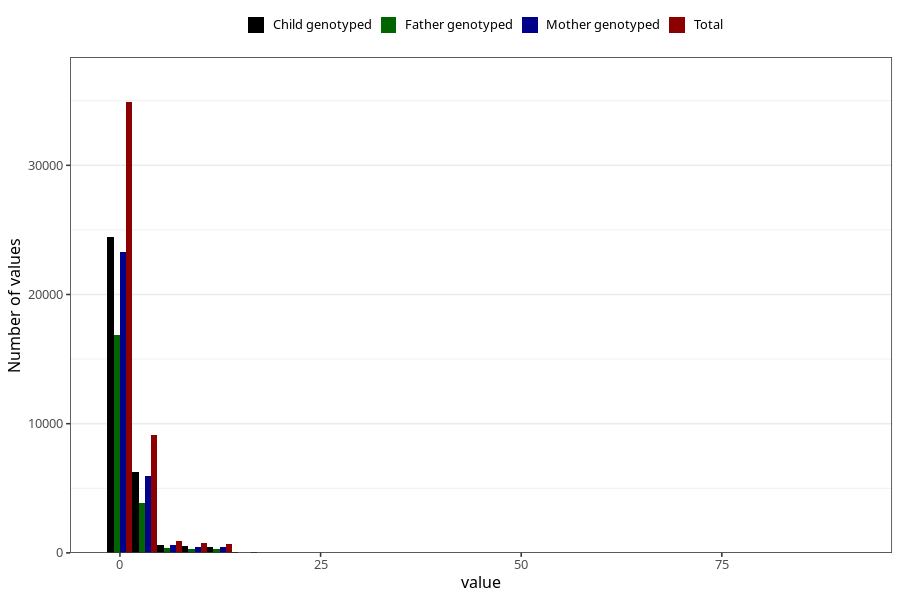

# coke_before
Variable mapping to questionnaire: q1m, question AA1392.
- Number of values:

| Value | Total | Child genotyped | Mother genotyped | Father genotyped |
| ----- | ----- | --------------- | ---------------- | ---------------- |
| Missing | 67199 | 47769 | 40957 | 28459 |
| Non-missing | 46424 | 35586 | 30812 | 21759 |
| Consumption have been reported by a mark but no amount given | 11 | 6 | 4 |2 |
| 25th percentile | 0 | 0 | 0 | 0 |
| 50th percentile | 0 | 0 | 0 | 0 |
| 75th percentile | 1 | 1 | 1 | 1 |

