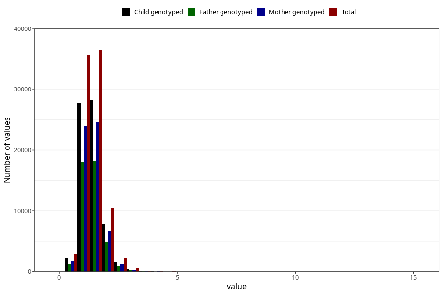

# copper
Variable mapping to questionnaire: q2_cwd_calculations, question KOPPER.
- Number of values:

| Value | Total | Child genotyped | Mother genotyped | Father genotyped |
| ----- | ----- | --------------- | ---------------- | ---------------- |
| Missing | 24927 | 14790 | 12674 | 6238 |
| Non-missing | 88696 | 68565 | 59095 | 43980 |
| 25th percentile | 1.12 | 1.12 | 1.12 | 1.12 |
| 50th percentile | 1.36 | 1.35 | 1.35 | 1.35 |
| 75th percentile | 1.64 | 1.63 | 1.63 | 1.62 |

