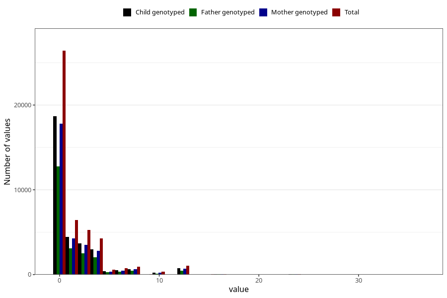

# diet_coke_before
Variable mapping to questionnaire: q1m, question AA1398.
- Number of values:

| Value | Total | Child genotyped | Mother genotyped | Father genotyped |
| ----- | ----- | --------------- | ---------------- | ---------------- |
| Missing | 67413 | 42965 | 40889 | 28012 |
| Non-missing | 46210 | 32466 | 30880 | 22206 |
| Consumption have been reported by a mark but no amount given | 6 | 2 | 2 |1 |
| 25th percentile | 0 | 0 | 0 | 0 |
| 50th percentile | 0 | 0 | 0 | 0 |
| 75th percentile | 2 | 2 | 2 | 2 |

