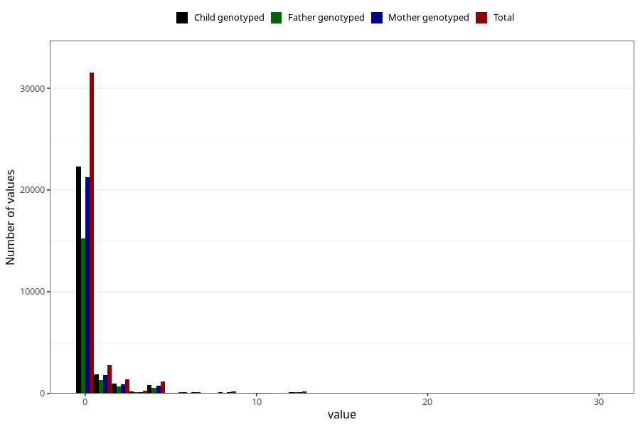

# diet_soda_before
Variable mapping to questionnaire: q1m, question AA1401.
- Number of values:

| Value | Total | Child genotyped | Mother genotyped | Father genotyped |
| ----- | ----- | --------------- | ---------------- | ---------------- |
| Missing | 75658 | 48689 | 46335 | 31891 |
| Non-missing | 37965 | 26742 | 25434 | 18327 |
| Consumption have been reported by a mark but no amount given | 4 | 3 | 3 |2 |
| 25th percentile | 0 | 0 | 0 | 0 |
| 50th percentile | 0 | 0 | 0 | 0 |
| 75th percentile | 0 | 0 | 0 | 0 |

