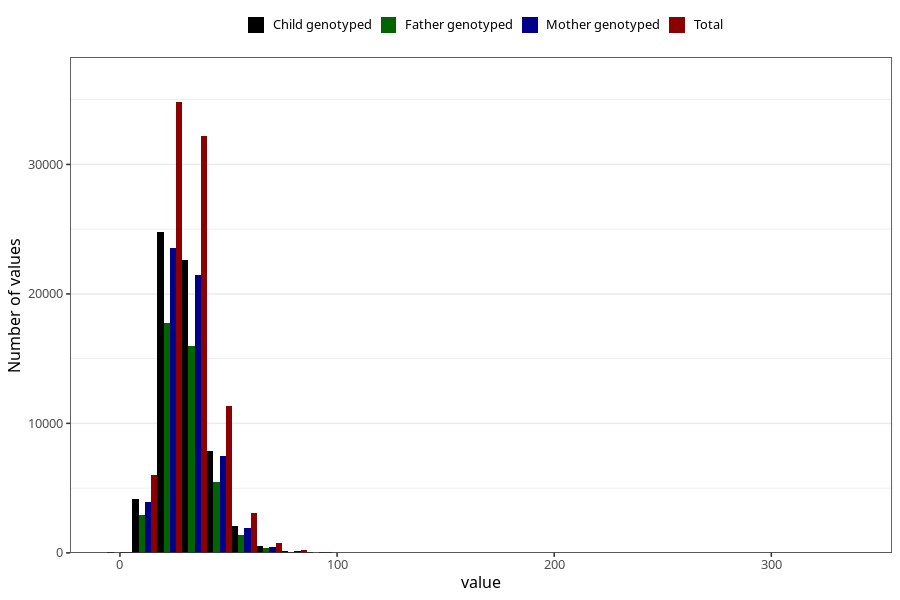

# dietary_fiber
Variable mapping to questionnaire: q2_cwd_calculations, question FIBER.
- Number of values:

| Value | Total | Child genotyped | Mother genotyped | Father genotyped |
| ----- | ----- | --------------- | ---------------- | ---------------- |
| Missing | 24927 | 14790 | 12674 | 6238 |
| Non-missing | 88696 | 68565 | 59095 | 43980 |
| 25th percentile | 23.64 | 23.62 | 23.63 | 23.61 |
| 50th percentile | 29.6 | 29.51 | 29.46 | 29.37 |
| 75th percentile | 36.83 | 36.66 | 36.59 | 36.43 |

