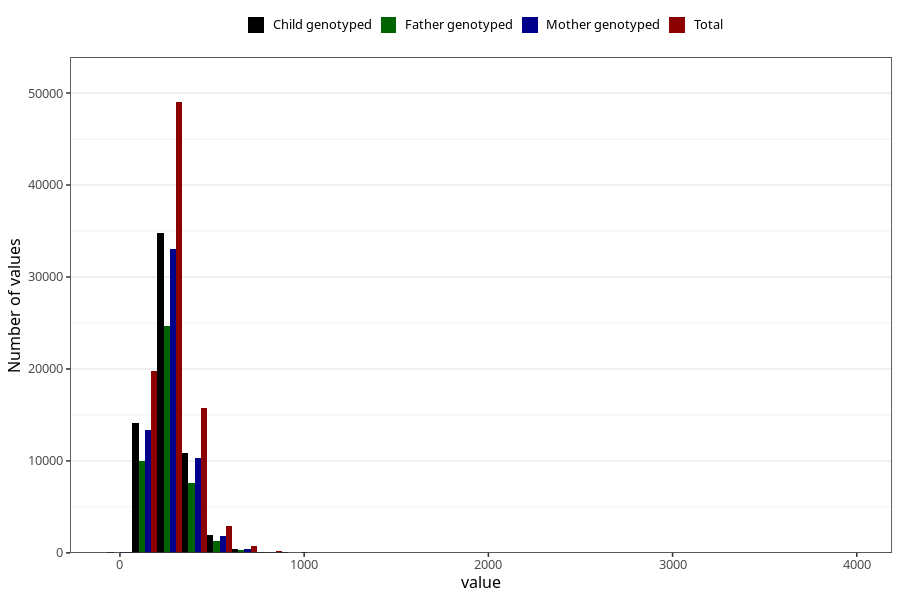

# folate
Variable mapping to questionnaire: q2_cwd_calculations, question FOLAT.
- Number of values:

| Value | Total | Child genotyped | Mother genotyped | Father genotyped |
| ----- | ----- | --------------- | ---------------- | ---------------- |
| Missing | 24927 | 13198 | 12674 | 6238 |
| Non-missing | 88696 | 62233 | 59095 | 43980 |
| 25th percentile | 208.8075 | 207.9 | 207.9 | 207.8775 |
| 50th percentile | 262.07 | 260.58 | 260.4 | 260.07 |
| 75th percentile | 328.3125 | 325.12 | 324.82 | 324.64 |

